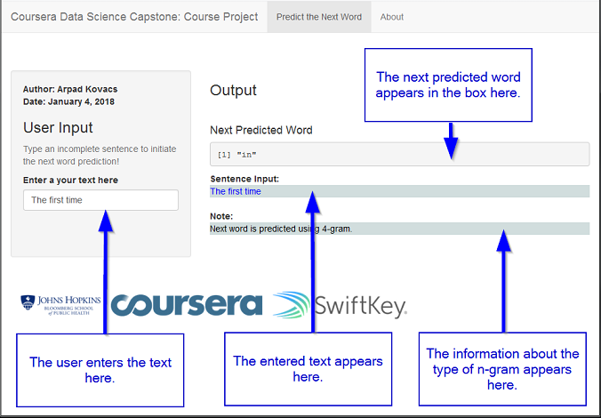

Coursera Data Science Capstone: Course Project
========================================================
author: Arpad Kovacs
date: Thu Jan 04 19:17:55 2018

Next Word Prediction

Introduction
========================================================
type: sub-section
This presentation is created as part of the requirement for the Coursera Data Science Capstone Course - Final Project. 

The goal of the project is to build a predictive text model combined with a shiny app UI that will predict the next word as the user types a sentence. This is similar to the way most smart phone keyboards are implemented today (i.e.Swiftkey technology).

*Shiny App* - [https://arpadthetall.shinyapps.io/capstone]

*Github Repo* - [https://github.com/arpadthetall/capstone]

Getting & Cleaning Data
========================================================
type: sub-section

The data used in the app was first processed and cleaned according to the steps below. :

1. A subset of the original data was randomly sampled from three sources (blogs,twitter and news) and merged into one.
2. The data cleaning was done by converting to lowercase, stripping white space, removing punctuation and numbers.
3. The corresponding n-grams were created (Quadgram,Trigram and Bigram).
4. The term-count tables were extracted from the N-Grams and sorted according to the frequency in descending order.
5. The n-gram objects were saved as R-Compressed files (.RData files).

Word Prediction Model
========================================================
type: sub-section

The prediction model for the next word is based on the Katz Back-off algorithm. Explanation of the next word prediction flow is below:

1. Compressed data sets containing descending frequency sorted n-grams are loaded.
2. User input words are cleaned similarly to words used in the n-grams.
3. First a Quadgram is used (first three words of Quadgram are the last three words of the user provided sentence).
4. If no Quadgram is found, back off to Trigram (first two words of Trigram are the last two words of the sentence).
5. If no Trigram is found, back off to Bigram (first word of Bigram is the last word of the sentence)
6. If no Bigram is found, back off to the most common word with highest frequency 'the' is returned.

Shiny Application
========================================================
type: sub-section

A UI was developed along with the previously described program to form a Shiny application. Screenshot below. 
</img>
